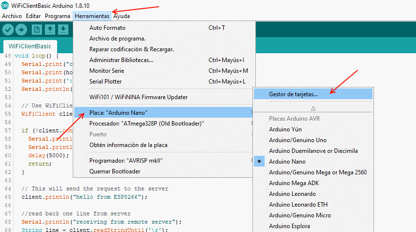
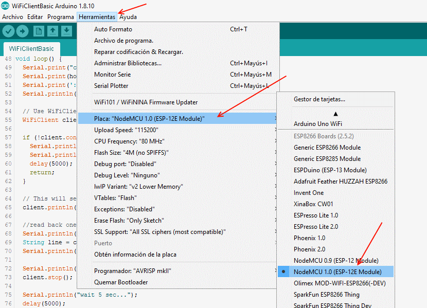
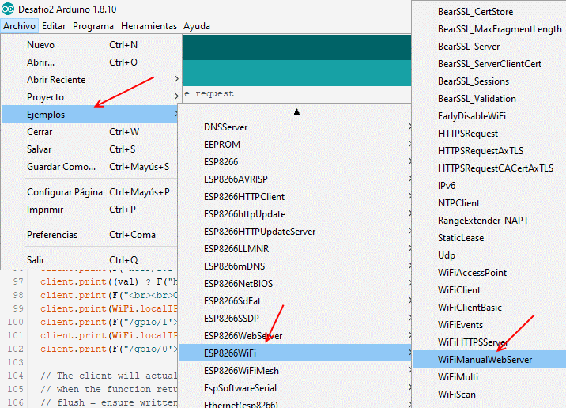

# Kit de Taller

- [ESP8266 NodeMCU v3](https://es.aliexpress.com/item/32965623530.html?spm=a2g0s.9042311.0.0.465063c0ZkESIK)
- [USB Cable](https://es.aliexpress.com/item/33063307001.html?spm=a2g0s.9042311.0.0.274263c06676gq)
- [Mini Breadboard](https://es.aliexpress.com/item/32655910710.html?spm=a2g0o.productlist.0.0.24663c53hgrOIp)
- [Jumper Cables](https://es.aliexpress.com/item/33038355606.html?spm=a2g0s.9042311.0.0.274263c0XEySyf)
- [LEDs](https://es.aliexpress.com/item/32886530132.html?spm=a2g0s.9042311.0.0.274263c0LKVxhL)
- [PIR Sensor HC-SR501](https://es.aliexpress.com/item/32733268757.html?spm=a2g0o.productlist.0.0.3ad361eaJmPVh6)
- [4.5V AAA Battery Case](https://es.aliexpress.com/item/32788925539.html?spm=a2g0o.productlist.0.0.72de6097ZVvz3G)
- [AAA Batteries](https://www.amazon.es/AmazonBasics-Pilas-alcalinas-industrial-unidades/dp/B07MLDJF3B)
- [5V Relay](https://es.aliexpress.com/item/32787576149.html?spm=a2g0o.productlist.0.0.550d43e1WM2Jas)

# Instalacion

Instala el [IDE de Arduino](https://www.arduino.cc/en/main/software) si no lo has hecho ya.

Si tienes Windows o Max OSC baja e instala los [drivers](/drivers) para conexion por USB usando el chip [CH340](https://www.rubinolab.com/clone-arduino-driver-chip-ch340-ch340g-ch341/). Ya tienes los drivers de otro taller? no hace falta instalarlos otra vez.

Si tienes Linux no hace falta instalar los drivers, ya viene instalados con la mayoria de las distribuciones linux.

## Anadir la placa ESP8266 al Arduino IDE

0. Archivo > Preferencias > Gestor de URLs de Tarjetas > http://arduino.esp8266.com/stable/package_esp8266com_index.json
1. Herramientas > Placa > Gestor de tarjetas...
2. Buscar "esp8266" y elegir "esp8266 by ESP8266 Community"
3. Instalar
4. Herramientas > Placa .. > "NodeMCU v1.0 (ESP-12E Module)" (o el módulo en particular que uses).
5. Herramientas > Puerto > (lo que aparezca, por ejemplo COM5)






# Desafio 1: Como controlar los pines.


### Código 

```cpp
/*
  Blink

  Turns an LED on for one second, then off for one second, repeatedly.
*/

// the setup function runs once when you press reset or power the board
void setup() {
  // initialize digital pin LED_BUILTIN as an output.
  pinMode(D8, OUTPUT);
}

// the loop function runs over and over again forever
void loop() {
  digitalWrite(D8, HIGH);   // turn the LED on (HIGH is the voltage level)
  delay(1000);                       // wait for a second
  digitalWrite(D8, LOW);    // turn the LED off by making the voltage LOW
  delay(1000);                       // wait for a second
}
```

# Desafio 2: Conectar el ESP8266 a nuestro Wi-Fi.




### Código 

https://github.com/north-hackerspace/taller-domotica/blob/master/soluciones/Desafio2/Desafio2.ino

# Desafio 3: Encender y apagar un LED desde el móvil con MQTT.


### Código 

https://github.com/north-hackerspace/taller-domotica/blob/master/soluciones/Desafio3/Desafio3.ino

# Desafio 4: Saber el estado de un sensor en tu dispositivo desde cualquier lugar.


Vamos a usar el sensor de movimiento HC-SR501, [aqui teneis mas informacion sobre el modulo](https://lastminuteengineers.com/pir-sensor-arduino-tutorial/).

A efectos practicos, lo que queremos es leer el movimiento con la funcion `digitalRead(D2)` de Arduino (si hay movimiento es `1`, si no es `0`) y encender un LED de indicador amarillo en el pin D6. 

A la vez vamos a mandar este valor por un canal de MQTT usando el topic  `/hackerspace/sensor`:

```cpp
// Lineas 100 en adelante

void loop() {

  if (!client.connected()) {
    reconnect();
  }
  client.loop();

  long now = millis();
  // Cada medio segundo mirar el sensor de movimiento
  if (now - lastMsg > 500) {
    int sensorVal = digitalRead(D2);
    // Ha cambiado el sensor?
    if (sensorVal != lastSensorVal) {
      Serial.print("The Sensor is: ");
      Serial.println(sensorVal);
      snprintf (msg, 50, "%ld", sensorVal);
      client.publish("/north-hackerspace/sensor", msg);
      lastSensorVal = sensorVal;
      digitalWrite(D6, sensorVal);
    }
  }
  // Cada 5 segundos mandar mensaje por MQTT
  if (now - lastMsg > 5000) {
    lastMsg = now;
    ++value;
    snprintf (msg, 50, "Hello #%ld", value);
    Serial.print("Publish message: ");
    Serial.println(msg);
    client.publish("/north-hackerspace/messages", msg);
  }
}

```

### Código 

https://github.com/north-hackerspace/taller-domotica/blob/master/soluciones/Desafio4/Desafio4.ino


# Desafio 5: Encender y apagar un relé de alta potencia a través de internet.


### Código 

https://github.com/north-hackerspace/taller-domotica/blob/master/soluciones/Desafio5/Desafio5.ino

# Completo: Un dispositivo que notifica sensor de presencia, y se puede usar para encender y apagar la luz


### Código 

https://github.com/north-hackerspace/taller-domotica/blob/master/soluciones/Completo/Completo.ino

# Como preparar cables:


