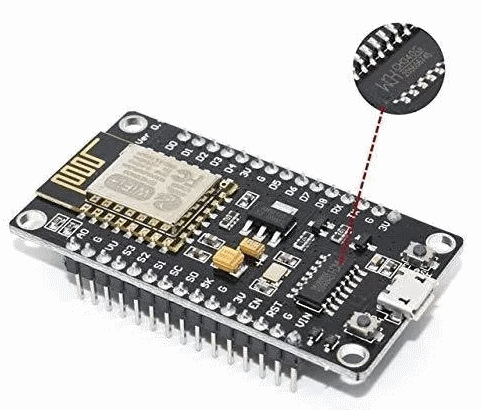

El chip CH340/CH341 es un chip barato chino que traduce el UART (que es el protocolo para programar dispositivos) 
en protocolo de USB (que es la forma mas facil de acceder a las placas desde el ordenador).

Aqui encontraras los drivers. Solo hay que bajarlos y seguir las instrucciones.

La compania que los comercializa es esta:

http://www.wch.cn/download/CH341SER_ZIP.html

Si quieres saber mas acerca del chip CH340 y como instalarlo puedes leer aqui:

https://learn.sparkfun.com/tutorials/how-to-install-ch340-drivers/all
